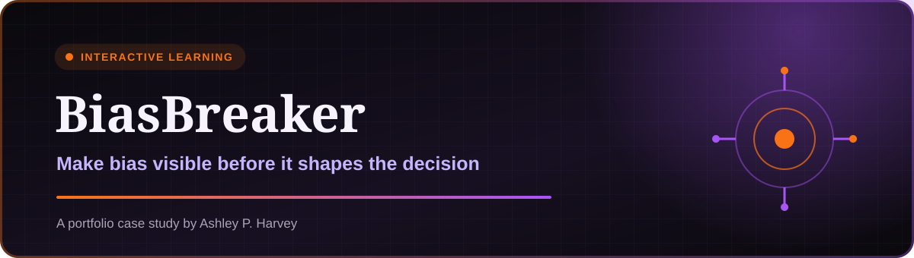
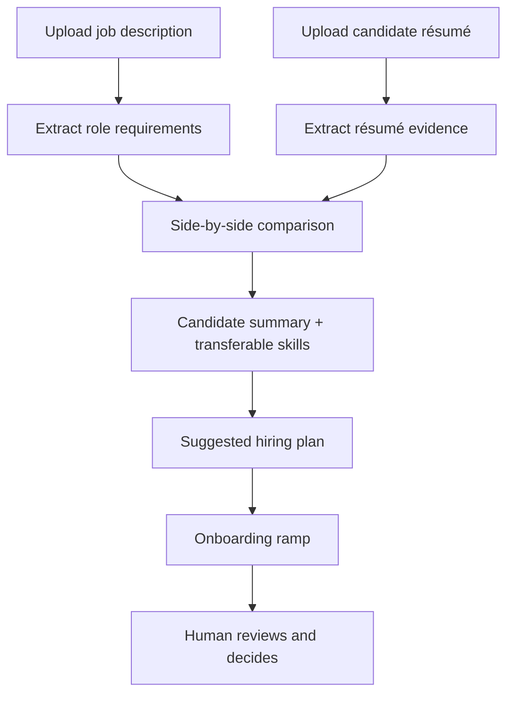

  

## ▶ Watch the demo

**[Open the full BiasBreaker walkthrough →](https://github.com/user-attachments/assets/1d53480f-42c3-40b3-9e75-a9a89e34e2ed)**

The recording shows a job description and résumé being evaluated side by side, followed by a candidate summary, evidence comparison, suggested hiring plan, and onboarding ramp.

## The challenge

Typical AI-enabled applicant tracking systems often reduce candidates to a score or ranking. That can hide the reasoning behind the result and disadvantage people whose experience does not follow a conventional path.

Transferable skills, nonlinear careers, and career changes are easy to miss when titles and keywords are treated as substitutes for evidence.

## The solution

**BiasBreaker is a GPT-powered candidate evaluator that does not rank candidates or make hiring decisions.**

A user uploads a job description and a candidate's résumé. BiasBreaker then organizes the available evidence so a recruiter or hiring manager can understand the candidate's alignment without relying on a black-box score.

## What BiasBreaker produces

| Output | Purpose |
|---|---|
| **Candidate summary** | Provides a concise, job-relevant overview of the candidate's experience |
| **Side-by-side qualification comparison** | Maps job requirements to skills and evidence explicitly found in the résumé |
| **Transferable-skills analysis** | Surfaces relevant capabilities that may appear under different titles or industries |
| **Suggested hiring plan** | Identifies areas to validate and proposes a structured path for continued evaluation |
| **Onboarding ramp** | Suggests how the candidate's strengths can be used immediately and where support may be helpful |

## How it works

## Designed differently from ranking systems

| BiasBreaker does | BiasBreaker does not |
|---|---|
| Shows the evidence behind each comparison | Assign a candidate score |
| Separates résumé evidence from assumptions | Rank candidates against one another |
| Surfaces transferable skills | Auto-reject applicants |
| Highlights information to validate | Infer protected characteristics |
| Suggests interview and onboarding support | Make the final hiring decision |

## Why this matters

BiasBreaker makes candidate evaluation easier to understand. Instead of returning a unexplained fit score, it shows where the résumé contains supporting evidence, where information is missing, and what the hiring team may want to validate next.

That approach can help teams more fairly consider:

- Career changers
- Candidates with nonlinear work histories
- People moving across industries
- Candidates whose titles differ from the target role
- Applicants with strong transferable skills that keyword matching may overlook

## Human-in-the-loop safeguards

- Every output is a draft for recruiter or hiring-manager review.
- Missing résumé evidence is labeled as unknown—not treated as proof that a skill is absent.
- BiasBreaker does not recommend automatic rejection.
- The same job-related criteria should be applied consistently to every candidate.
- Interviewers must validate experience directly with the candidate.
- Final hiring decisions remain with accountable humans.

## Example

See the [sample candidate evaluation](./examples/sample-candidate-evaluation.md) for a fictional role and candidate.

## Business value

BiasBreaker gives hiring teams a clearer, more transparent way to assess candidate evidence while expanding visibility into transferable skills and nontraditional career paths.

---

**Status:** Portfolio case study based on a working custom GPT. The public repository excludes proprietary instructions and configuration files.
