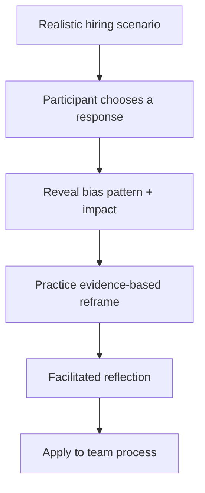

  

## The challenge

Bias training often explains concepts without changing the moment when a decision is made. Hiring teams need practice noticing bias in realistic situations, separating job evidence from assumptions, and choosing a more consistent next step.

## The solution

**BiasBreaker** is an interactive learning experience that presents realistic hiring scenarios, asks participants to make a decision, then reveals the possible bias pattern and a stronger evidence-based response.

### Learning objectives

Participants practice how to:

- Recognize common bias patterns in hiring
- Separate evidence from assumptions
- Identify inconsistent standards
- Reframe subjective feedback
- Ask job-relevant follow-up questions
- Use structured criteria without outsourcing judgment to AI

## Learning flow

## Scenario design

| Component | Purpose |
|---|---|
| **Ambiguous decision point** | Mirrors how bias appears in real work |
| **Multiple plausible responses** | Avoids an obvious compliance quiz |
| **Immediate explanation** | Connects the choice to its impact |
| **Evidence-based alternative** | Gives the learner a usable replacement behavior |
| **Reflection prompt** | Moves learning from individual awareness to team practice |

## Responsible-AI approach

BiasBreaker does not claim that AI can remove human bias. AI can help generate practice variations and facilitate reflection, but scenarios require expert review, and hiring decisions remain human responsibilities governed by consistent job-related criteria.

## Example

See the [sample learning scenario](./examples/sample-scenario.md).

## Business value

BiasBreaker turns abstract awareness into decision practice that can be embedded in recruiter training, interviewer calibration, manager development, and responsible-AI programs.

---

**Status:** Portfolio case study for an interactive learning product. Proprietary facilitation materials and client-specific scenarios are intentionally excluded.
